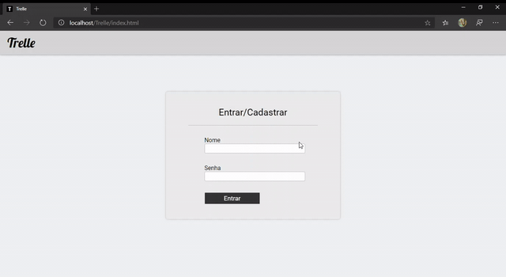

# Trelle
Sistema para gerenciamento de tarefas baseado no Trello.

### Sobre
Esse sistema foi criado como projeto para uma das disciplinas do curso Técnico em Informática para Internet.

### Bibliotecas Js usadas:
<ul>
  <li>Alertifyjs</li>
  <li>JQuery</li>
  <li>Pace</li>
</ul>
